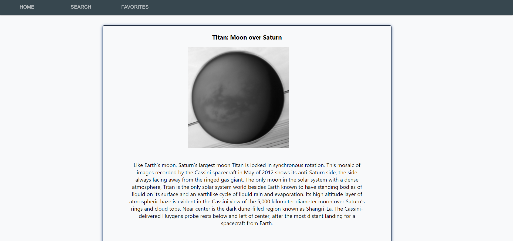
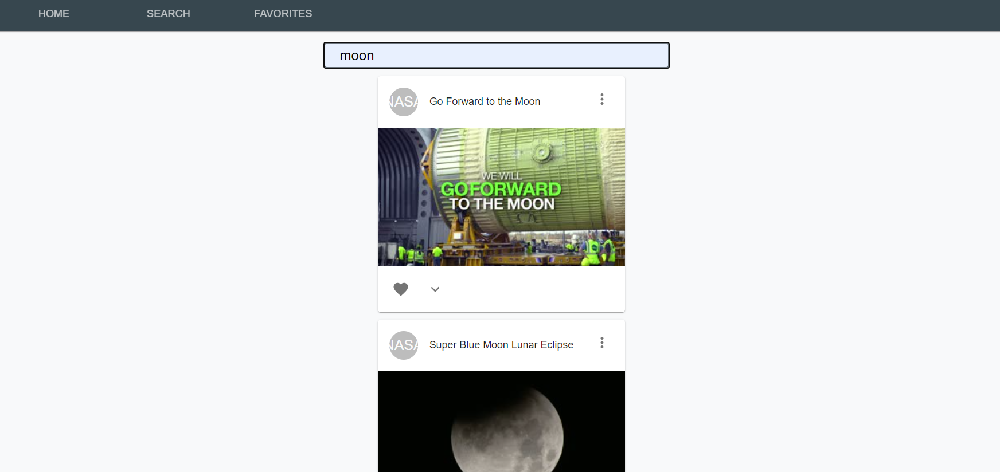
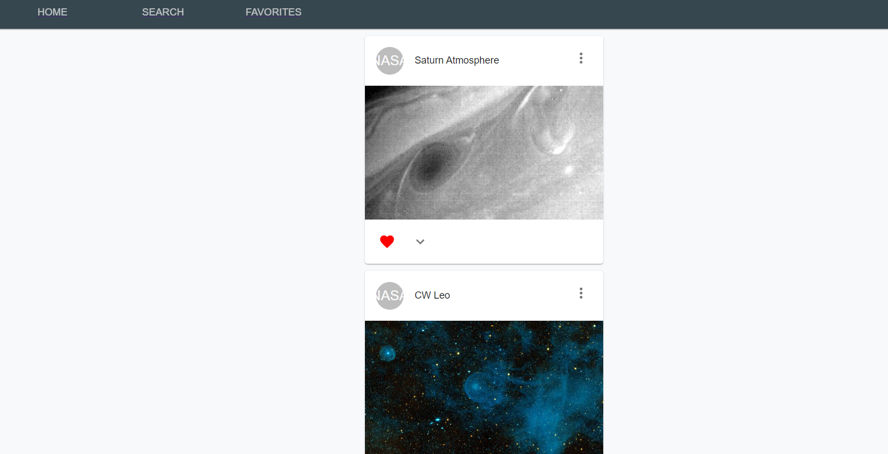

NASApp

 This is a application for space buffs - You can check NASA's daily picture, search for images and save the ones you like.

Technologies: React, Hooks, Express, MongoDB, Mongoose, Nasa API, Material UI and pure CSS.

Home page

View NASA daily picture and description.

Search

Search for images and save the one you like.

Favorites

View all your favorite pictures.

